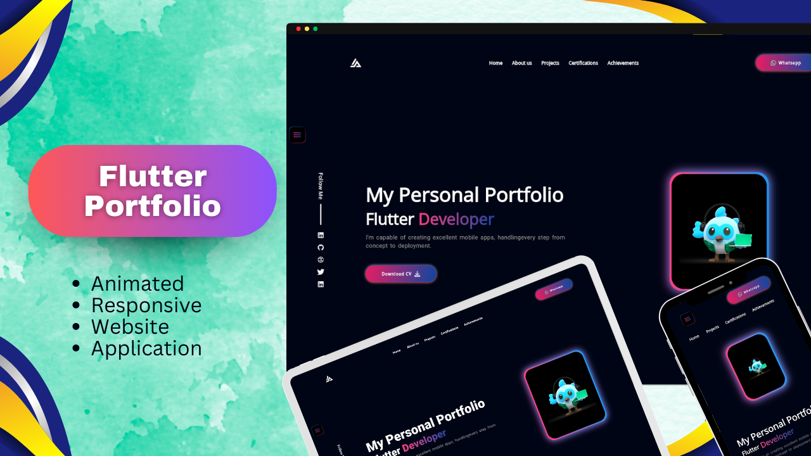

# Responsive Flutter Portfolio Application & Website
Explore my portfolio crafted with Flutter and Dart, boasting a stunningly responsive design. Dive into a showcase of my work, elegantly presented with a captivating user interface.

## Screenshots

## Technologies and Packages Used

The portfolio website is built using Flutter, a powerful open-source UI software development toolkit. 

## Getting Started

To explore and interact with the portfolio website on your local machine, follow these steps:

1. **Clone the Repository:**
   git clone https://github.com/Hamad-Anwar/Flutter-Responsive-Portfolio-WebApp.git
2. **Install Dependencies:**
   flutter pub get
3. **Run Application**
   flutter run
